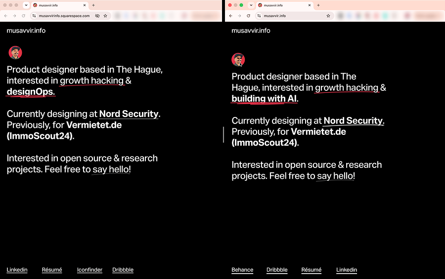

# Replacing an expensive Squarespace site with a free stack

**Live site:** [musavvir.info](https://musavvir.info/)

I used to pay Squarespace around **€132 annually**, to park a one-page personal site, because it was extremely convenient, I did not have to think about anything. Yet I always wanted out. I wanted the same site, preferably with zero costing. But I could find neither the time nor the energy to come up with an exit plan or an alternative stack.

Then came the silent revolutionary advent of agentic coding. I orchestrated the migration with coding agents behind a decision map powered by **GitHub Issues**, and mindfully placed the HITL steps (e.g. visual QA, DNS config, and domain transfers) into **interactive bash wizards** so I could click dashboards without inventing the order from memory.

**Outcome:** [musavvir.info](https://musavvir.info/) still looks like its former Squarespace-self. Its hosting cost beyond the domain is effectively €0 (thanks to Cloudflare Pages). And the expensive Squarespace subscription liability is finally gone.

|                  |                                                                                        |
| ---------------- | -------------------------------------------------------------------------------------- |
| **Problem**      | Squarespace was convenient but very expensive for a static personal website.           |
| **Goal**         | Identical site, ideally €0 recurring cost beyond domain, and leave Squarespace billing.|
| **Method**       | Human defined goals, agent-led planning (agent asks clarifying questions → human answers → converted to ADRs) + HITL for visual QA + human runs dashboard wizards for go-live → agents run smoke tests → human declares success or failure  |
| **Current host** | This GitHub repo → Cloudflare Pages                                                    |
| **Edit model**   | Git-as-CMS: `content/*.yaml` + optional Sveltia at `/admin`.                           |
